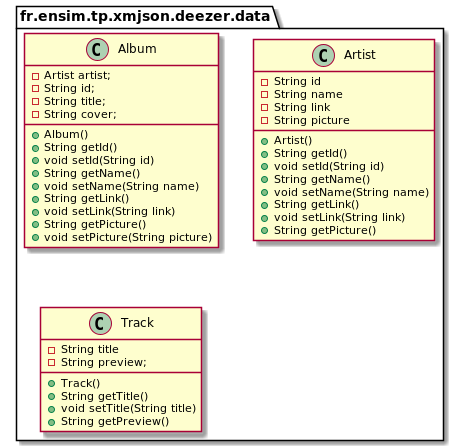
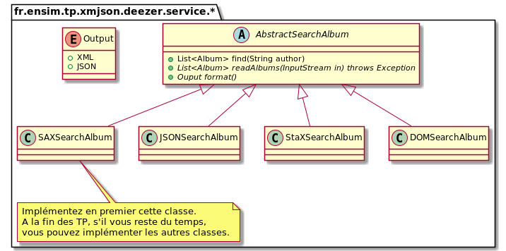
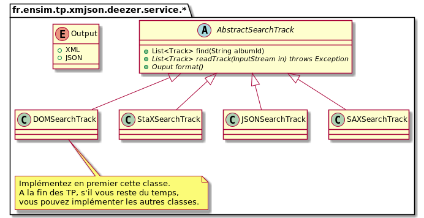
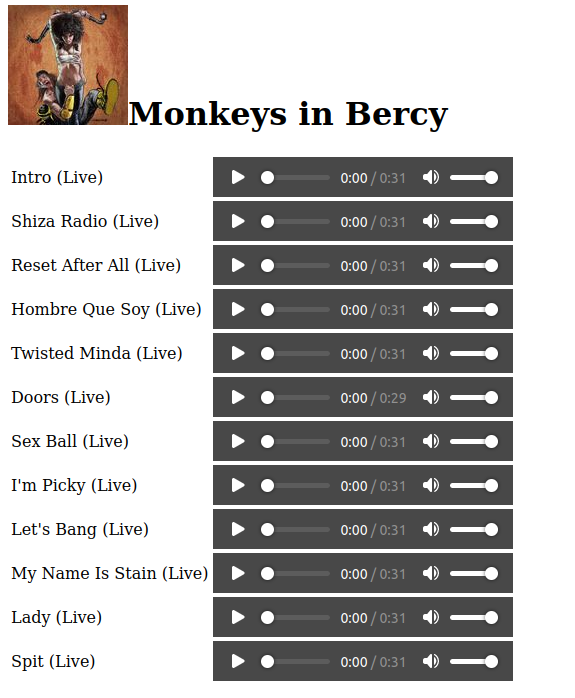
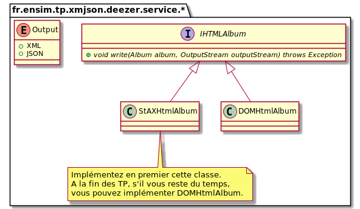

# Travaux Pratiques Technologies XML/JSON/JWT

## Objectifs
* Lire des documents XML avec les API SAX, DOM
* Ecrire des documents XML en StaX API pour lire des documents XML
* Lire des documents JSON 

## Présentation du projet
<a href="https://developers.deezer.com/api">

</a>

L'API REST Deezer offre des services pour découvrir de la musique.
Elle offre notamment les services suivants :
* Rechercher les albums d'un auteur.
* Rechercher les chansons d'un album.

Pour plus d'information sur l'API Deezer, vous pouvez consulter le lien suivant [https://developers.deezer.com/api](https://developers.deezer.com/api)

Les classes Album, Artist et Track sont décrites dans le package fr.ensim.tp.xmjson.deezer.data

  

## Partie 1 : XML
###1.1 Rechercher les albums d'un auteur avec l'API SAX
Exemple : rechercher les albums de Shaka Ponk en XML

* API REST [http://api.deezer.com/2.0/search/album?q=Shaka%20Ponk&output=xml](http://api.deezer.com/2.0/search/album?q=Shaka%20Ponk&output=xml)

* UML  
  

* Implémentation à compléter :  
    * Source [src/main/java/fr/ensim/tp/xmljson/deezer/service/sax/SAXSearchAlbumsHandler.java](src/main/java/fr/ensim/tp/xmjson/deezer/service/sax/SAXSearchAlbumsHandler.java)
* Test unitaire à réaliser  
    * Jeu de test [src/test/resources/data/list-album-shakaponk.xml](src/test/resources/data/list-album-shakaponk.xml)

###1.2 Rechercher les titres d'un album avec l'API DOM
Exemple : rechercher l'album dont l'id est 81993952  

* API REST [http://api.deezer.com/2.0/album/81993952?output=xml](http://api.deezer.com/2.0/album/81993952?output=xml)

* UML  
  

* Implémentation à compléter :
    * Source [src/main/java/fr/ensim/tp/xmljson/deezer/service/dom/DOMSearchTrack.java](src/main/java/fr/ensim/tp/xmjson/deezer/service/dom/DOMSearchTrack.java)
* Test unitaire à réaliser
    * Jeu de test [src/test/resources/data/album-81993952.xml](src/test/resources/data/album-81993952.xml)

###1.3 Ecrire une page HTML5 affichant les chansons de l'album en StaX

* Exemple de page HTML5 :  
 

* UML  
  

* Implémentation à compléter :
  * Source [src/main/java/fr/ensim/tp/xmljson/deezer/service/stax/StAXHtmlAlbum.java](src/main/java/fr/ensim/tp/xmjson/deezer/service/stax/StAXHtmlAlbum.java)

###1.4 Exécutez la class [src/main/java/fr/ensim/xml/deezer/Main.java](src/main/java/fr/ensim/tp/xmjson/deezer/Main.java)
La classe Main effectue les traitements suivants :
* Appel de l'API SAX pour rechercher les albums de Shaka Ponk
* Ecriture en DOM du 1er album
* Ecriture de la page HTML en StAX
* Ouverture du navigateur par défaut avec la page HTML.

## Partie 2 : JSON
###2.1 Rechercher les albums d'un auteur en JSON
* API REST [http://api.deezer.com/2.0/search/album?q=Shaka%20Ponk&output=json](http://api.deezer.com/2.0/search/album?q=Shaka%20Ponk&output=json)
* API JSON [https://docs.oracle.com/javame/8.0/api/json/api/index.html?com/oracle/json/JsonObject.html](https://docs.oracle.com/javame/8.0/api/json/api/index.html?com/oracle/json/JsonObject.html)

* Implémentation à compléter :
  * Source [src/main/java/fr/ensim/tp/xmljson/deezer/service/json/JSONSearchAlbums.java](src/main/java/fr/ensim/tp/xmjson/deezer/service/json/JSONSearchAlbums.java)
  * Test unitaire à réaliser. Jeu de test [src/test/resources/data/list-album-shakaponk.xml](src/test/resources/data/list-album-shakaponk.xml)

## Partie 3 : JWT
###Bonus 
Creer un jeton JWT suivant
* Header 
```
{ 
"alg": "HS256",
"typ": "JWT"
}
```
* Payload 
```
{
  "sub": "1234567890",
  "name": "John Doe",
  "iat": 1516239022
}
```
* Signature  HMAC-SHA256

